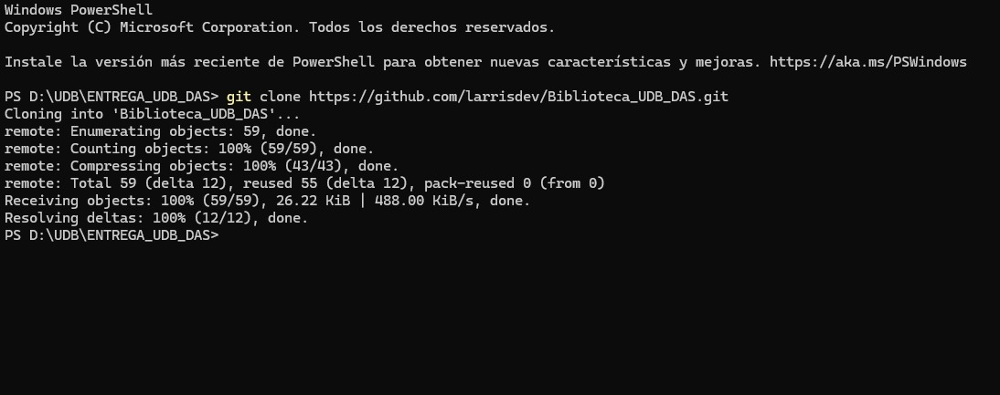
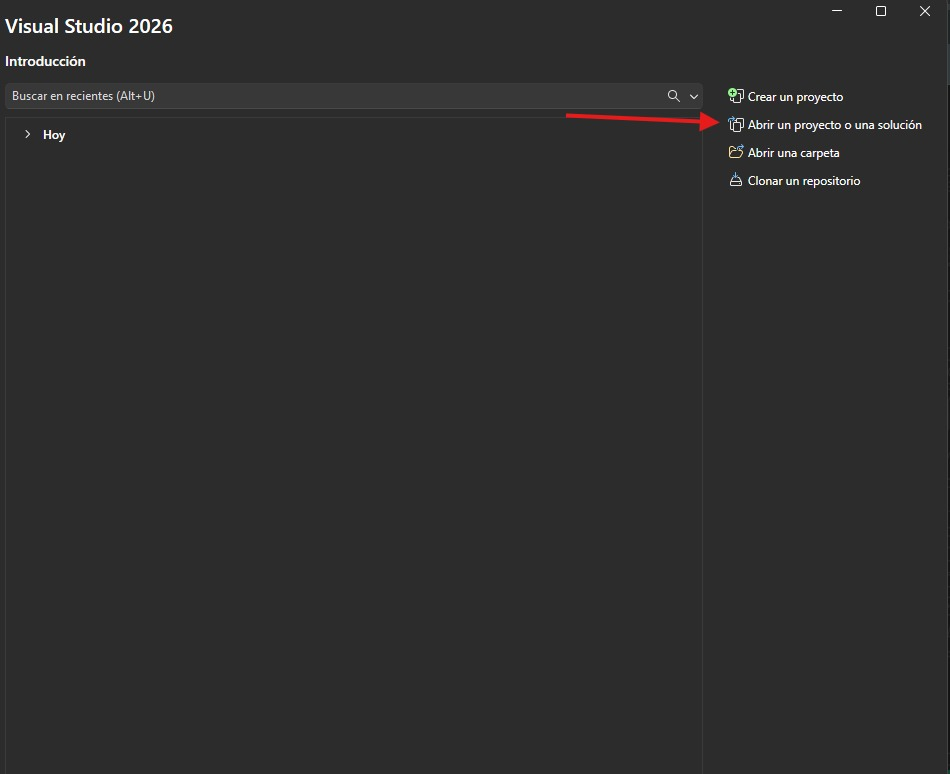
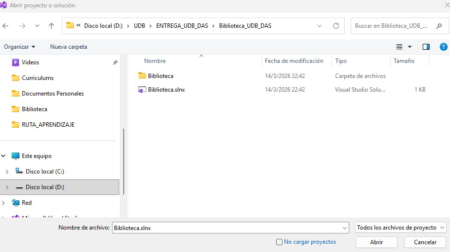
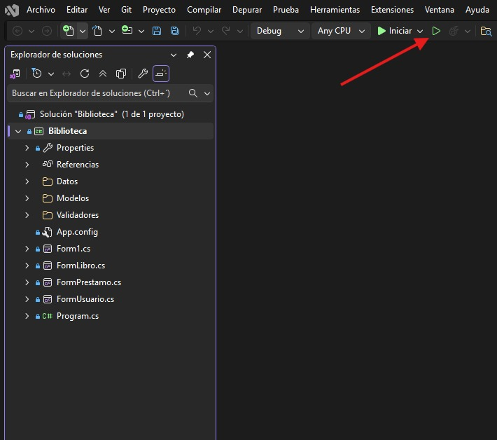

# Biblioteca_UDB_DAS

## Capturas

Clonar el repositorio en la carpeta de preferencia. 

Abrir Visual Studio 2026 y seleccionar la opción abrir un proyecto. 

Buscar la ruta donde se clonó el repositorio. Y abrir la carpeta siguiente \Biblioteca_UDB_DAS 

Para ejecutar el programa dar clic en el botón de play. 

